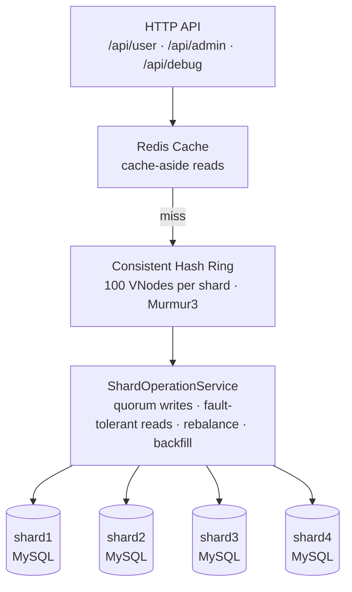

# ShardNest — Distributed Sharded Database


A sharded database layer built from scratch in **Java / Spring Boot**. ShardNest implements **consistent hashing**, **RF=3 replication**, **quorum writes**, **live rebalancing**, and **Redis caching**, the same core ideas behind systems like Cassandra, DynamoDB, and MongoDB.

---

## Features

- **Consistent hashing with virtual nodes**: even data distribution across shards
- **Dynamic shard provisioning**: add new databases at runtime via REST API
- **Live rebalancing**: add or remove shards while the system keeps serving requests
- **Replication factor 3**: every record lives on 3 shards for fault tolerance
- **Quorum writes (W=2 of N=3)**: fast, safe writes that tolerate one shard failure
- **Fault-tolerant reads**: automatic fallback across replicas
- **Backfill / reconciliation**: repair under-replicated data
- **Redis cache-aside**: significantly faster reads and reduced database load
- **Cache invalidation**: delete-on-write to avoid stale reads
- **Debug endpoints**: inspect the ring, replica sets, data locations, and cache

---

## Architecture



**Request flow**

1. **Read:** check Redis, and on a miss route the key through the hash ring, read from the primary (falling back to replicas), then populate the cache.
2. **Write:** compute the replica set for the key, write to all 3 shards in parallel, and return success once 2 confirm. Then evict the cache entry.
3. **Topology change:** adding or removing a shard updates the ring and migrates only the affected key ranges.

---

## Key Design Decisions

### 1. Consistent Hashing over Modulo

With `hash(key) % N`, changing the shard count remaps most keys, forcing a near-total data migration. With consistent hashing, adding a shard moves only about **1/N of the keys**, and only the affected arc of the ring is touched. That makes rebalancing practical on a running system.

### 2. Virtual Nodes (VNodes)

If each shard sits at a single position on the ring, distribution is badly skewed. ShardNest places **100 VNodes per shard**, so the ring has hundreds of positions and each shard's share converges toward the ideal. The deviation shrinks roughly with `1/√vnodeCount`.

### 3. Murmur3 instead of `String.hashCode()`

`String.hashCode()` is nearly linear: `"shard1#0"` and `"shard1#1"` hash to values that differ by 1, so VNodes cluster together. **Murmur3** has a strong avalanche effect (one input bit change flips about half of the output bits), so VNodes spread evenly around the ring.

### 4. RF=3 with Quorum Writes

- Each record is stored on 3 shards, so the system tolerates **one shard failure without data loss**.
- Writes go to all replicas in parallel and succeed once **W=2** acknowledge, which is faster than waiting for all 3 while still surviving a single failure.
- Reads currently fall back across replicas. Quorum reads with read repair (R=2, so W+R > N) are on the roadmap for stronger consistency guarantees.

### 5. `saveAndFlush` and Fresh Entity Copies

`save()` calls `merge()` for entities with a preset ID, so if the same object is already in the persistence context Hibernate issues an `UPDATE` instead of an `INSERT`.

**Fix:** use `saveAndFlush()` and always write a **fresh copy** of the entity per shard, never reusing one object across shards.

### 6. Cache-Aside over Write-Through

- **Read:** check cache, and on a miss read the DB, populate the cache, and return.
- **Write:** write to the DB, then delete the cache entry so the next read repopulates it.

Updating the cache on write introduces race conditions with concurrent reads. Delete-on-write avoids them by forcing a fresh DB read.

---

## Getting Started

### Prerequisites

- Java 23
- Maven
- MySQL 8+ with four databases: `userdb1`, `userdb2`, `userdb3`, `userdb4`
- Redis 7+ running on `localhost:6379`

### Setup

```bash
# 1. Clone the repository
git clone https://github.com/yourusername/shardNest.git
cd shardNest

# 2. Create the four MySQL databases (userdb1 to userdb4).
#    Tables are created automatically on startup.

# 3. Start Redis
docker run -d --name redis-shardnest -p 6379:6379 redis:7-alpine

# 4. Run the application
mvn spring-boot:run
```

The API is available at `http://localhost:8080`. Additional shards can be provisioned at runtime through the admin API.

---

## API Overview

### User

| Method | Endpoint | Description |
|--------|----------|-------------|
| POST | `/api/user/create` | Create a user (replicated to 3 shards) |
| GET | `/api/user/{id}` | Read a user (cache-aside) |
| DELETE | `/api/user/delete/{id}` | Delete a user from all replicas |

### Admin: Shards

| Method | Endpoint | Description |
|--------|----------|-------------|
| POST | `/api/admin/shard/add` | Add a shard to the ring and rebalance |
| POST | `/api/admin/shard/remove` | Remove a shard and drain its data |
| POST | `/api/admin/shard/backfill` | Repair under-replicated users |
| GET | `/api/admin/shard/list` | List all shards |
| GET | `/api/admin/shard/status` | Check rebalance status |

### Admin: DataSource Provisioning

| Method | Endpoint | Description |
|--------|----------|-------------|
| POST | `/api/admin/datasource/provision` | Create a database, tables, and DataSource at runtime |

### Debug

| Method | Endpoint | Description |
|--------|----------|-------------|
| GET | `/api/debug/ring` | Full hash ring |
| GET | `/api/debug/ring/summary` | VNode distribution summary |
| GET | `/api/debug/route/{key}` | Route a key to its primary shard |
| GET | `/api/debug/replicas/{key}` | Show the replica set for a key |
| GET | `/api/debug/distribution/{count}` | Run a distribution test |
| GET | `/api/debug/user-locations/{id}` | Compare expected vs actual replicas |
| GET | `/api/debug/cache/health` | Redis health |
| GET | `/api/debug/cache/user/{id}` | Inspect a cached entry |

---

## Performance Characteristics

Approximate figures from local development runs:

| Operation | Latency | Notes |
|-----------|---------|-------|
| Cache hit | ~1–5 ms | No DB access |
| Cache miss (read) | ~30–50 ms | DB read + cache write |
| Create user (quorum) | ~50–100 ms | Parallel writes, W=2 |
| Delete user | ~100–150 ms | Sequential across replicas |
| Add shard | ~1–10 s | Depends on data size |
| Backfill | ~1–60 s | Depends on data size |

**Scalability notes**

- **Shards:** scale horizontally by adding shards at runtime
- **Read throughput:** substantially higher with the Redis cache
- **Storage overhead:** 3x due to RF=3
- **Failure tolerance:** one shard can fail without data loss

---

## What I Learned

- **Framework defaults can hide bugs.** `open-in-view: true` seemed harmless until sharding exposed it.
- **JPA entity identity matters.** Reusing one object across databases silently breaks inserts.
- **Failure handling is most of the code.** The happy path is easy; partial failures, timeouts, and fallbacks are where the complexity lives.
- **Consistency vs availability is real.** Quorum size, cache TTL, and sync vs async replication each trade one for the other.
- **Idempotency makes recovery easy.** Backfill, rebalance, and cache eviction are all safe to retry.
- **Observability pays off.** Logs and debug endpoints turned multi-hour bugs into short fixes.

---

## Roadmap

- [ ] Quorum reads with read repair (R=2, detect stale replicas)
- [ ] Async replication (write to primary, replicate in background)
- [ ] Circuit breaker for Redis (skip when down, recover automatically)
- [ ] Prometheus metrics and Grafana dashboards
- [ ] Anti-entropy repair job (Merkle trees)
- [ ] Leader election for replica promotion (Raft)
- [ ] Distributed transactions (saga pattern)
- [ ] Kubernetes deployment manifests

---

## Tech Stack

| Layer | Technology |
|-------|------------|
| Language | Java 23 |
| Framework | Spring Boot 4.1 |
| ORM | Hibernate / Spring Data JPA |
| Database | MySQL (4 shards) |
| Cache | Redis 7 + Lettuce |
| Serialization | Jackson 3 |
| Hash Function | Murmur3 (Guava) |
| IDs | ULID |
| Build | Maven |

---

## Acknowledgments

Inspired by:

- Amazon Dynamo paper (2007): consistent hashing and replication
- Apache Cassandra: VNodes and tunable consistency
- MongoDB: replica sets
- Martin Kleppmann's *Designing Data-Intensive Applications*

---

## Contact

**Author:** [Bhuvan V]
**Email:** [bhuvanvachar0123@gmail.com]
**LinkedIn:** [https://www.linkedin.com/in/bhuvan-v-188284246](https://www.linkedin.com/in/bhuvan-v-188284246)
